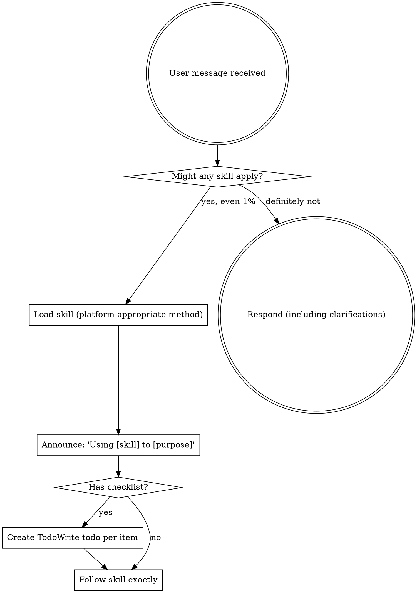
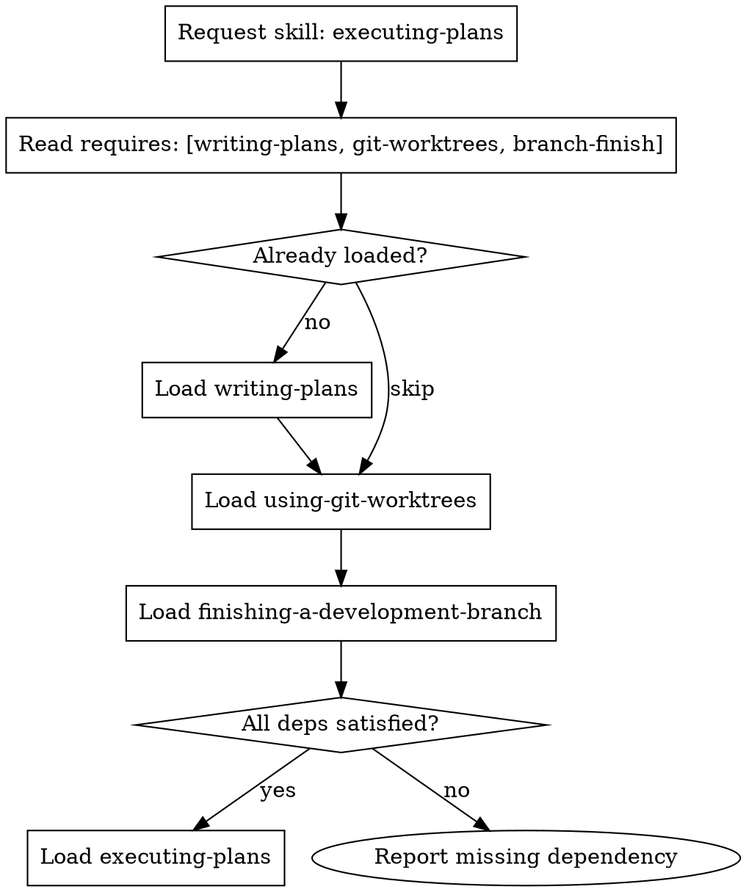

<EXTREMELY-IMPORTANT>
If you think there is even a 1% chance a skill might apply to what you are doing, you ABSOLUTELY MUST invoke the skill.

IF A SKILL APPLIES TO YOUR TASK, YOU DO NOT HAVE A CHOICE. YOU MUST USE IT.

This is not negotiable. This is not optional. You cannot rationalize your way out of this.
</EXTREMELY-IMPORTANT>

## How to Access Skills (Platform Detection)

Read `.ai/settings.json` → check `platform.current` to determine your loading mechanism:

| If `platform.current` is... | Then... |
|-----------------------------|---------|
| `claude-code` | Use the `Skill` tool to invoke the skill by name. Never use the Read tool on skill files. |
| `opencode` | Use the `skill()` function to load the skill by name. |
| `codex` | Read the skill's `SKILL.md` file directly using your file-reading capability. Look in `.ai/skills/<phase>/<skill>/SKILL.md`. |
| `antigravity` | Read the skill's `SKILL.md` file directly using your file-reading capability. Look in `.ai/skills/<phase>/<skill>/SKILL.md`. |
| `generic` (or anything else) | Read the skill's `SKILL.md` file directly using your file-reading capability. Look in `.ai/skills/<phase>/<skill>/SKILL.md`. |

**In all cases:** Load the skill BEFORE responding, acting, or asking clarifying questions.

# Using Skills

## The Rule

**Invoke relevant or requested skills BEFORE any response or action.** Even a 1% chance a skill might apply means that you should invoke the skill to check. If an invoked skill turns out to be wrong for the situation, you don't need to use it.

## Red Flags

These thoughts mean STOP—you're rationalizing:

| Thought | Reality |
|---------|---------|
| "This is just a simple question" | Questions are tasks. Check for skills. |
| "I need more context first" | Skill check comes BEFORE clarifying questions. |
| "Let me explore the codebase first" | Skills tell you HOW to explore. Check first. |
| "I can check git/files quickly" | Files lack conversation context. Check for skills. |
| "Let me gather information first" | Skills tell you HOW to gather information. |
| "This doesn't need a formal skill" | If a skill exists, use it. |
| "I remember this skill" | Skills evolve. Read current version. |
| "This doesn't count as a task" | Action = task. Check for skills. |
| "The skill is overkill" | Simple things become complex. Use it. |
| "I'll just do this one thing first" | Check BEFORE doing anything. |
| "This feels productive" | Undisciplined action wastes time. Skills prevent this. |
| "I know what that means" | Knowing the concept ≠ using the skill. Invoke it. |

## Dependency Resolution

When loading a skill, check its `requires:` frontmatter field. If present:

1. **Before loading the requested skill**, load each required skill first (same platform-appropriate method)
2. **Chain recursively**: if required skills also have `requires:`, load those first
3. **Skip already-loaded skills** (avoid duplicate loading)
4. **If a required skill is missing**, report the gap: "Cannot load [skill] — missing dependency: [missing skill]"

This ensures all prerequisite skills are available before the requested skill runs.

**Example:** Loading `executing-plans` automatically loads `writing-plans`, `using-git-worktrees`, and `finishing-a-development-branch` first.

## Skill Priority

When multiple skills could apply, use this order:

1. **Process skills first** (brainstorming, debugging) - these determine HOW to approach the task
2. **Implementation skills second** (frontend-design, mcp-builder) - these guide execution

"Let's build X" → brainstorming first, then implementation skills.
"Fix this bug" → debugging first, then domain-specific skills.

## Skill Types

**Rigid** (TDD, debugging): Follow exactly. Don't adapt away discipline.

**Flexible** (patterns): Adapt principles to context.

The skill itself tells you which.

## User Instructions

Instructions say WHAT, not HOW. "Add X" or "Fix Y" doesn't mean skip workflows.
